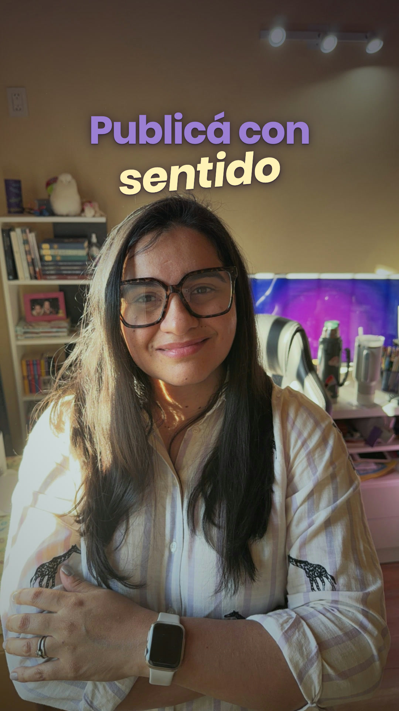
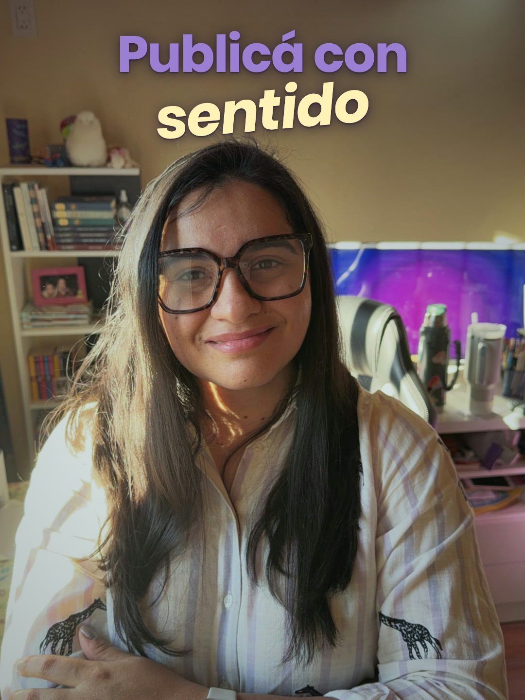

# Portadas de reels

La idea es **unificar todas las portadas** para que la grilla se vea ordenada. Siempre la misma estructura: tu foto, dos líneas de texto y nada más.

## La fórmula

- **Formato:** 1080×1920.
- **Foto:** vos, con la cara al centro y pared o fondo liso arriba de la cabeza. Mejor si se ven los colores de fondo (el monitor violeta, la biblioteca).
- **Línea 1:** Poppins Bold, en `lila` (#9B7FD4). Ejemplo: **Publicá con**.
- **Línea 2:** la palabra clave en Poppins Bold Italic, en `amarillo-suave` (#FFF2B8), apenas girada (−5°). Ejemplo: ***sentido***.
- **Mayúscula inicial** en la primera palabra.
- **Dos a cuatro palabras** en total.
- **Sin pastillas, sin logo y sin más texto.**

## Que se lea

- **Filtro de la foto:** colores apenas apagados, luces más bajas (que el sol no queme) y una viñeta suave en los bordes.
- **Degradé arriba:** violeta muy oscuro casi invisible, de `rgba(28,18,48,.42)` arriba a transparente a los 900 px, que se pierde antes de llegar a la cara.
- **Sombra del texto:** `0 2px 3px rgba(28,18,48,.55), 0 4px 18px rgba(28,18,48,.5), 0 0 44px rgba(28,18,48,.35)`.

## La grilla

Instagram recorta la portada en 3:4 en el perfil. Todo el título tiene que quedar **entre y = 240 y y = 1680**. El título arranca cerca de y = 300.

## Plantilla

`edicion-sentido/portada/portada.html` es la plantilla lista: se cambian los dos textos y la foto.

## Qué no hacer

- Mezclar tipografías distintas en cada portada.
- Usar otros colores en el título.
- Poner el texto encima de la cara.
- Sumar pastillas, emojis o subtítulos en la portada.
