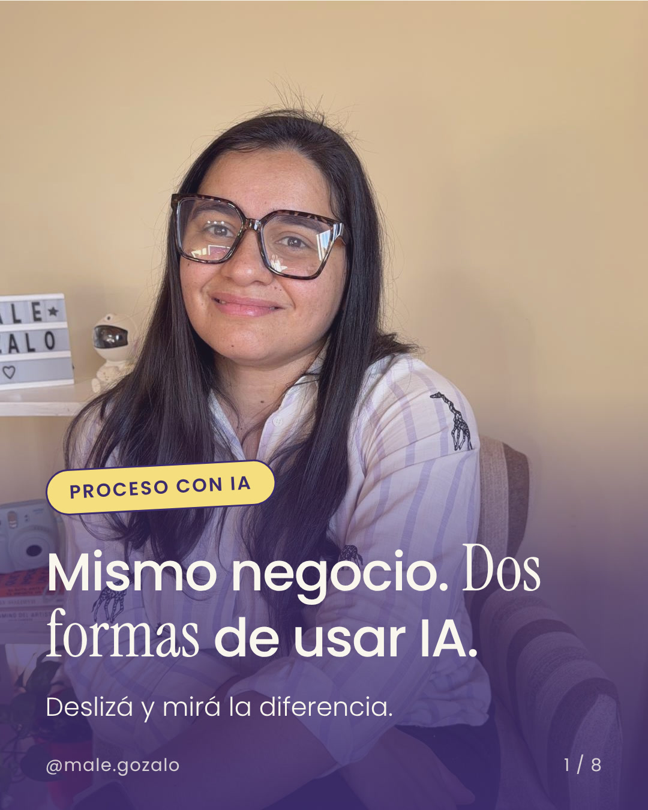
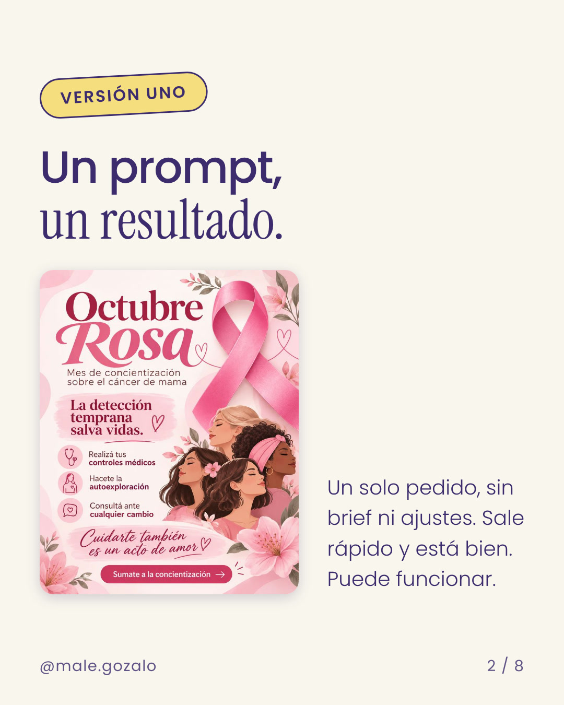
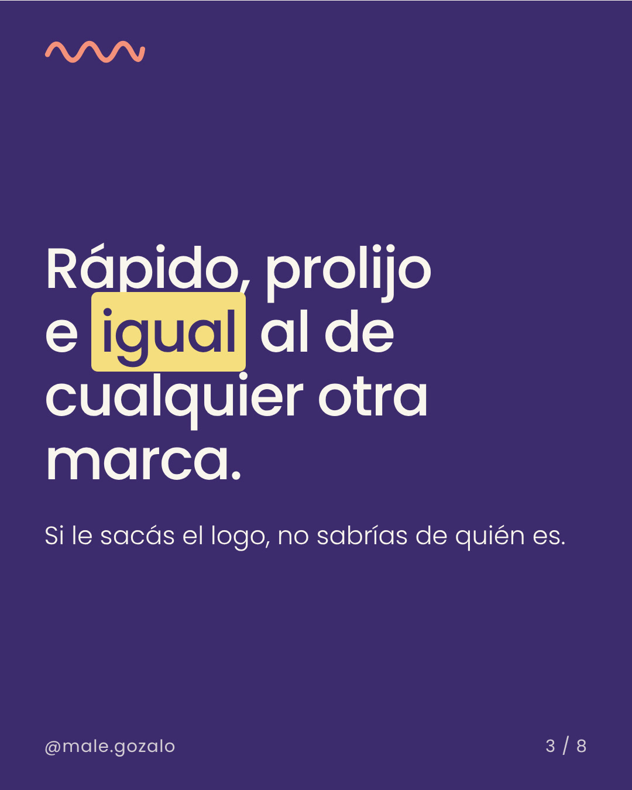
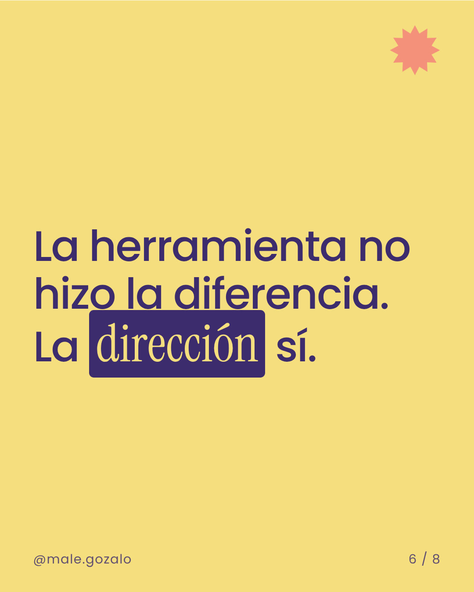
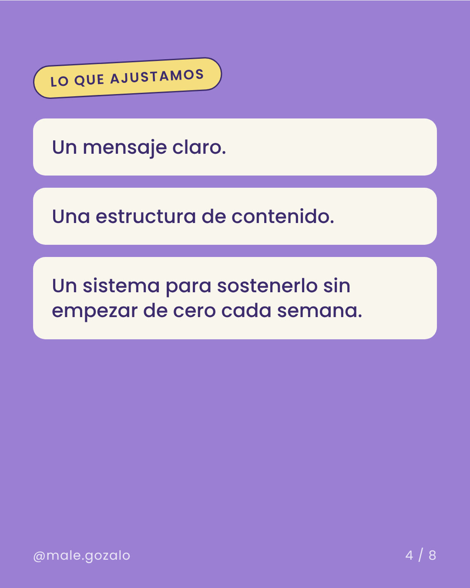
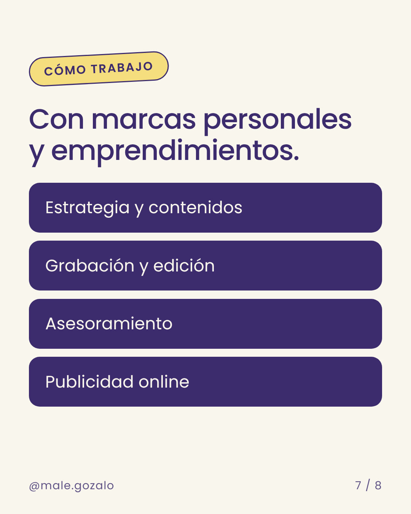
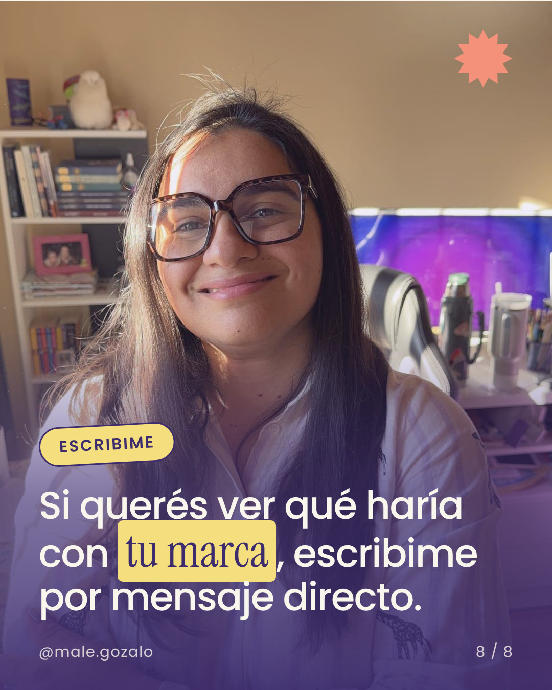

# Carruseles

Formato **1080×1350**, **8 slides**. Base: los dos carruseles de octubre de 2026 ("Mismo negocio. Dos formas de usar IA" y "Qué cambia cuando una marca deja de publicar por publicar").

## Estructura

| Slide | Fondo | Qué lleva |
|---|---|---|
| 1 · Portada | Tu foto con un degradé lila oscuro abajo | Pastilla + título en Figtree blanco con remate en Instrument Serif + "Deslizá y mirá la diferencia." |
| 2 | `crema` | Pastilla + título + cuerpo o imagen |
| 3 | `tinta` | Frase fuerte en blanco, palabra resaltada en `amarillo` |
| 4 | `lila` | Pastilla coral + título + tarjetas o imágenes |
| 5 | `crema` | Pastillas oscuras o un dato |
| 6 | `amarillo` | **La frase central**, sola, con una estrella en coral o lila |
| 7 | `crema` | Cierre del argumento o servicios en botones `tinta` |
| 8 · Cierre | Tu foto | Pastilla (`GUARDALO` o `ESCRIBIME`) + llamado a la acción |

## Elementos

- **Pastilla:** Figtree Bold en MAYÚSCULAS, borde `tinta` de 2 a 3 px, bordes redondos completos y apenas girada. Colores: `amarillo`, `coral` o `lima`, con texto `tinta`.
- **Resaltado tipo marcador:** un bloque `amarillo` detrás de una o dos palabras.
- **Caja oscura:** la palabra clave en Instrument Serif `crema` sobre un bloque `tinta` ("La *dirección* sí.", "*Decir mejor*, sí.").
- **Tarjetas:** blancas o crema con borde suave, para listas.
- **Botones de servicios:** bloques `tinta` con texto blanco.
- **Detalles:** la ondita coral (〰) arriba o abajo, y la estrella o *burst* en coral o lila.
- **Pie:** `@male.gozalo` a la izquierda y `1 / 8` a la derecha, en todas las slides.

## Etiquetas que ya usaste

`PROCESO CON IA` · `VERSIÓN UNO` · `VERSIÓN DOS` · `LO QUE HAY DETRÁS` · `EL EQUIPO` · `GUARDALO` · `CASO REAL` · `PUNTO DE PARTIDA` · `LO QUE VIMOS` · `LO QUE AJUSTAMOS` · `RESULTADO` · `CÓMO TRABAJO` · `ESCRIBIME`

## Qué no hacer

- Más de una slide con fondo amarillo.
- Texto blanco sobre amarillo, coral o lima.
- Más de una palabra en serif por frase.
- Textos largos: una idea por slide.
