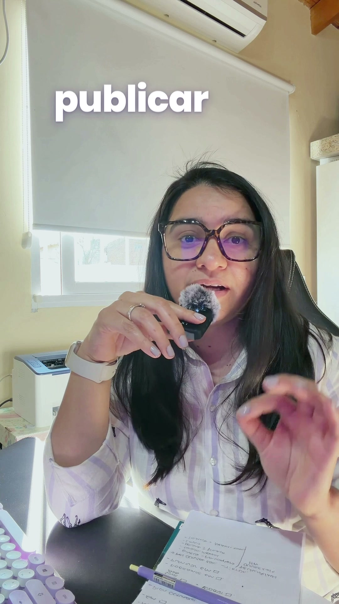
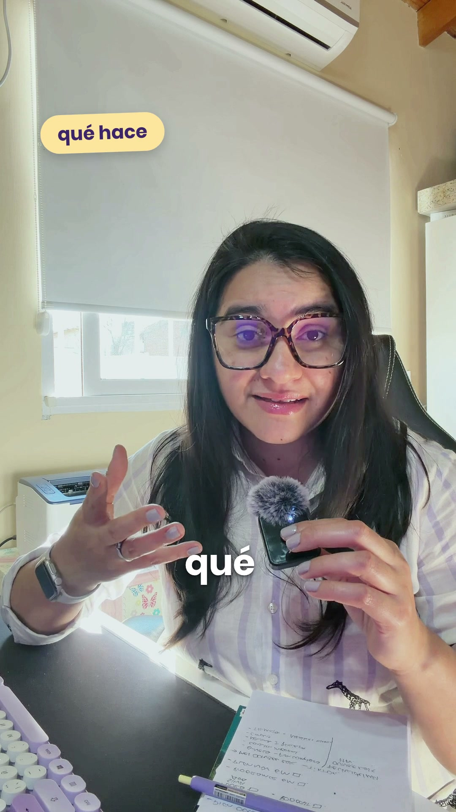
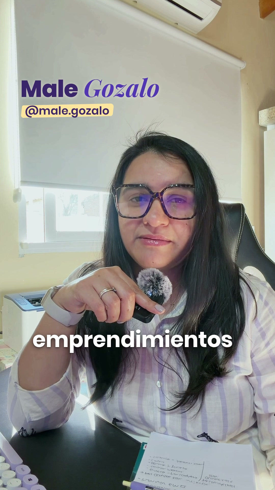

# Edición de video: Reels

Referencia: el reel **"Publicá con sentido"** (6 de octubre de 2026), en `edicion-sentido/`.

## El flujo, siempre en este orden

1. **Recibir el video** (MOV del iPhone, vertical). Si viene en HDR, pasarlo a color estándar (SDR) para que los textos no se vean quemados en Instagram.
2. **Transcribir palabra por palabra**, con tiempos.
3. **Proponer el plan:** el gancho (2 o 3 opciones) y una tabla de momentos gráficos con tiempo, qué aparece y la palabra que lo dispara.
4. **Storyboard** en HTML con cuadros reales del video, el color ya corregido, los gráficos en tamaño y lugar final, y la zona segura marcada. **No se renderiza hasta que lo apruebes.**
5. **Render final:** MP4 1080×1920, 30 fps (o los fps del original).
6. **Portada y copy** para publicar.

## La base de cada video

- **Silencios:** se cortan las pausas largas y queda un respiro de 0,12 s. En cada corte se alterna un zoom muy sutil (100 % y 106 %) para que el salto no se note.
- **Color:** bajar las luces de la ventana, levantar las sombras y la cara, y corregir el balance a un tono neutro cálido. Limpio, **sin filtro**. Si hay contraluz, aclarar esa toma para que quede pareja con el resto.
- **Audio:** filtro de graves, reducción de ruido, compresor suave y normalización a **−14 LUFS** (el estándar de Instagram) con pico máximo de **−1 dB**.
- **Música:** no, salvo que la pidas. La podés sumar en Instagram con audios en tendencia.
- **Efectos de sonido:** suaves (pop, whoosh, tic-tac, shimmer), unos **20 dB por debajo de la voz**. Un pop cuando entra cada pastilla.

## Subtítulos

- **Una palabra por vez.** Se leen más fácil y no se salen de la zona segura.
- **Poppins Bold** blanca, 86 px, con sombra suave.
- Las **palabras clave** en `amarillo-logo` (#FFE39A).
- Van **debajo de la cara**, en la franja de y ≈ 1250 a 1400.
- Escritos en **voseo, como hablás**.
- Se **ocultan** cuando aparece un texto gigante o la pregunta de cierre, para no repetir lo mismo dos veces.

## Zona segura de Instagram Reels

- Texto entre **y = 250** e **y = 1480**.
- Margen izquierdo **60 px** y derecho **160 px** (ahí están los botones de Instagram).
- **Nunca tapar la cara.**

## Momentos gráficos

**Cuántos:** 5 a 7 en un reel de unos 35 s, y tramos limpios entre medio para que respire.

| Tipo | Cómo se ve | Ejemplo |
|---|---|---|
| **Gancho** | Titular arriba los primeros 2 a 3 s | "Miles de views ≠ ventas" |
| **Texto gigante detrás tuyo** | La frase central enorme sobre la pared, con tu silueta recortada adelante | "publicar con *sentido*" |
| **Objeto que ilustra** | Un gráfico simple que muestra lo que decís | Reloj que gira rapidísimo en "minutos… segundos"; flyers que salen de tu dedo y se multiplican |
| **Pastillas** | Palabras que entran una por una con pop, cuando las nombrás | qué hace · para quién · por qué elegirla |
| **Nombre** | "Male *Gozalo*" en una línea + @male.gozalo con resaltado tipo marcador | Sin tarjeta de fondo |
| **Cierre** | Pregunta + @male.gozalo | "¿Querés ver *cómo lo hago?*" · **sin logo** |

## B-roll

1. Primero, clips tuyos: tus manos en la compu, el escritorio, el celular.
2. Si no hay, inserts animados con la marca (un celular con vistas que suben, una videollamada, un perfil con posteos).
3. Stock solo si hay créditos en Magnific/Freepik: los clips gratis vienen en 262×468 y se ven borrosos.

## Qué no hacer

- Amarillo como color principal de los gráficos.
- Sobreeditar: transiciones llamativas, emojis animados, efectos fuertes.
- Subtítulos de varias palabras por línea.
- Textos fuera de la zona segura o encima de la cara.
- Renderizar sin storyboard aprobado.

## Herramientas

- **HyperFrames + ffmpeg** (no After Effects).
- La skill **/estudio-motion**, con tu estilo guardado en `~/.claude/estudio-motion/estilo-male.md`.
- Los gráficos se generan desde código, así que cambiar tiempos, textos o colores y volver a exportar es rápido.
