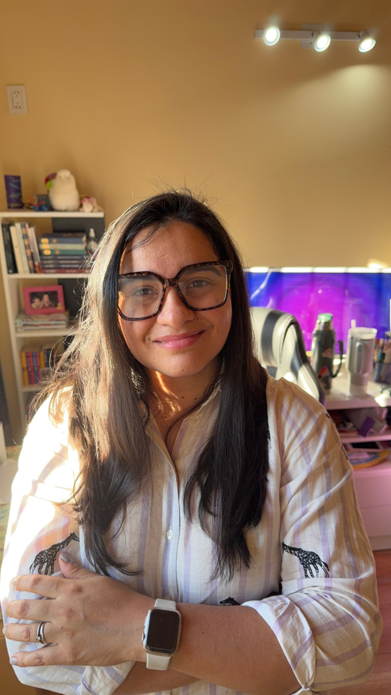
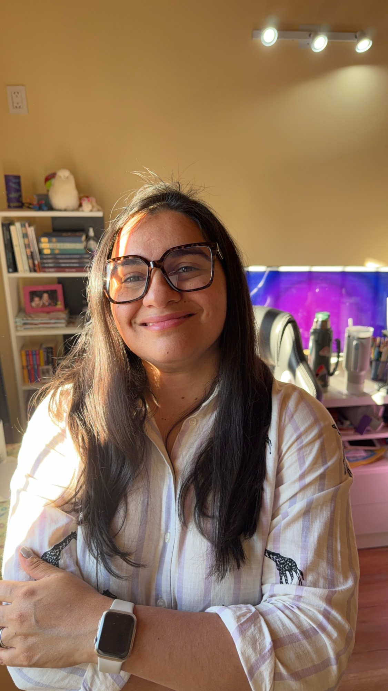
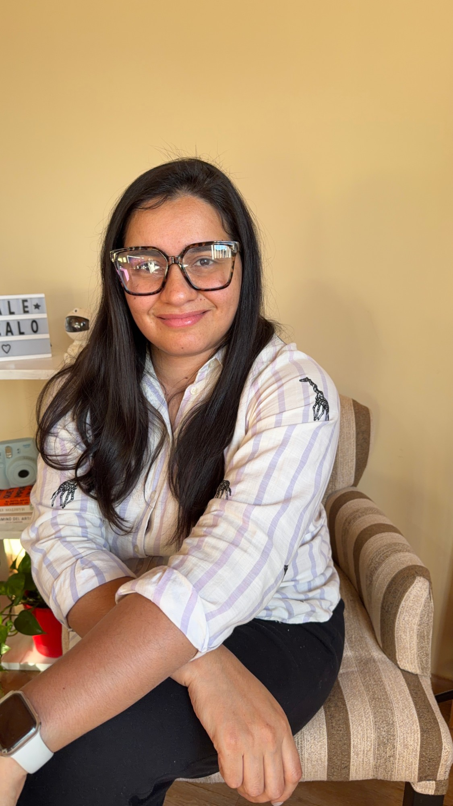
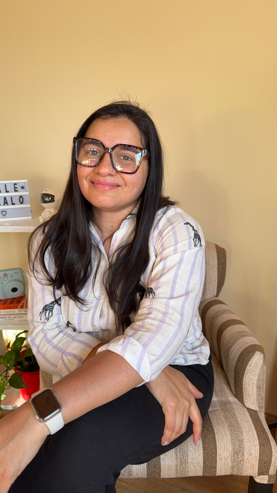

# Imágenes disponibles

Todo está en esta carpeta (`MG/MARCA/`), con nombres claros.

## Fotos tuyas

| Archivo | Qué es | Para qué sirve |
|---|---|---|
| `fotos/male-escritorio-1.jpg` y `-2.jpg` | Brazos cruzados, monitor violeta y biblioteca de fondo (octubre 2026) | **Portadas de reels** (la 1 es la de "Publicá con sentido") y cierres de carrusel |
| `fotos/male-sillon-1.jpg` y `-2.jpg` | Sentada en el sillón a rayas, sonriendo (octubre 2026) | Portadas de carrusel, "sobre mí", web |
| `fotos/bio-guino.png` y `bio-sonrisa.png` | Tu cara recortada sobre índigo, guiñando y sonriendo (320×320) | Foto de perfil, stickers, avatar |

## Retratos generados con IA

`fotos/retrato-ia-1.jpg` a `-4.jpg`: retratos con luz cálida de tarde (remera negra o blazer con remera lila), hechos con ChatGPT en septiembre de 2026. Sirven para web, propuestas o presentaciones. Para contenido de "cómo trabajo" conviene usar fotos reales.

## Logo y stickers

| Archivo | Qué es |
|---|---|
| `logo/mg-logo.png` | Logo original |
| `logo/mg-logo-circulo.png` | Logo recortado al círculo |
| `stickers/modo-creadora.png` | Sticker "Modo Creadora · MaleGozalo" sobre lila claro (1080×1350) |

## Referencias de piezas terminadas

| Archivo | Qué es |
|---|---|
| `referencias/portada-reel-publica-con-sentido.jpg` | La portada modelo |
| `referencias/portada-vista-grilla.jpg` | Cómo se ve recortada en el perfil |
| `referencias/carrusel-ia-01.jpg` a `-08.jpg` | Carrusel "Mismo negocio. Dos formas de usar IA" |
| `referencias/carrusel-caso-real-01.jpg` a `-08.jpg` | Carrusel "Qué cambia cuando una marca deja de publicar por publicar" |
| `referencias/reel-sentido-*.jpg` | Cuadros del reel "Publicá con sentido" |
| `referencias/intro-youtube.jpg` | La intro de YouTube |

## Dónde están los originales

| Qué | Carpeta |
|---|---|
| Reel "Publicá con sentido" (video, portada, copy, storyboard) | `MG/edicion-sentido/` |
| Reel "Miles de views ≠ ventas" | `MG/videos/reel-miles-de-views/` |
| Video de YouTube sobre WhatsApp (guía, subtítulos, video editado) | `MG/SEP/YOUTUBE/0916_edicion/` |
| Carruseles de octubre (PNG originales) | `escritorio/Carruseles Male Gozalo/` |
| App interna MG Studio | `MG/mg-studio/` |
| Productos y web | `MG/OCTUBRE/Productos y web MG Studio.html` |

## Fotos que faltan

Para tener un banco completo convendría sumar: tus manos en la compu, el escritorio desde arriba, el celular en la mano y alguna foto de cuerpo entero. Sirven como B-roll de los reels y como fondo de carruseles.
